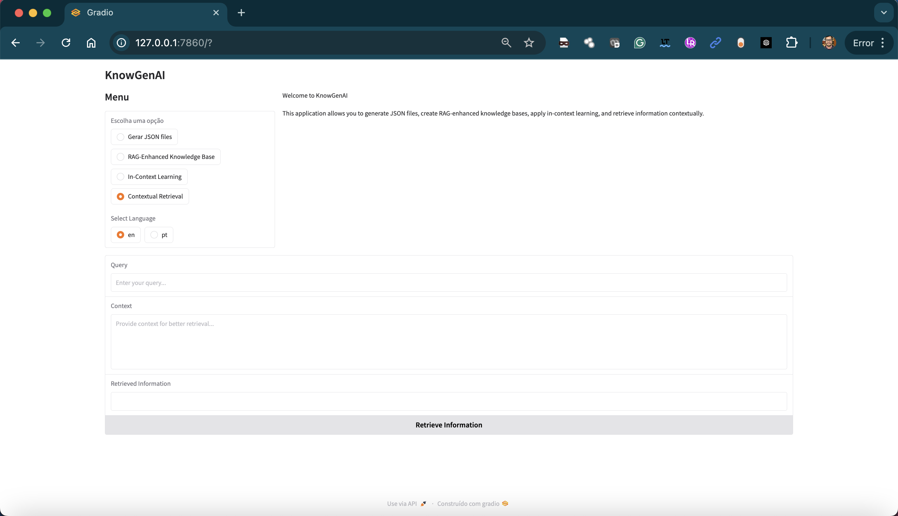

# **KnowGenAI**
## - Knowledge Base Generator with RAG, ICL, and Contextual Retrieval

**KnowGenAI** is a Python-based project designed to generate JSON-formatted knowledge bases from question-answer pairs. It now integrates advanced techniques like Retrieval-Augmented Generation (RAG), In-Context Learning (ICL), and Contextual Retrieval for enhanced information retrieval and dynamic question answering with large language models (LLMs).




## Features

### 1. Generate JSON Files
Convert question-answer pairs into structured JSON files, including metadata such as title, segment, and journey. This structure allows for easy access and utilization of the generated information in later analyses.

### 2. Export to ZIP
The generated JSON files can be automatically exported into a ZIP archive. This makes it easy to download and organize the generated data in a single compressed file.

### 3. RAG-Enhanced Knowledge Base
The application includes functionality to create embeddings and store them in a vector database for semantic search and RAG implementation. This enhances the retrieval of relevant information based on context.

### 4. In-Context Learning
Provide context and examples to language models (LLMs), using question-answer examples from the knowledge base for dynamic generation. This allows for more relevant and context-aware responses.

### 5. Contextual Retrieval
Implement a mechanism for contextual retrieval that allows users to obtain precise and contextually relevant information based on user queries, enhancing the overall user experience and accuracy of responses.

### 6. Gradio-based UI
A simple Gradio-based interface for uploading question-answer sets and downloading knowledge base files, making the application user-friendly and accessible.

## **Table of Contents**
- [Installation](#installation)
- [Usage](#usage)
- [Gradio Interface](#gradio-interface)
- [Knowledge Base Structure](#knowledge-base-structure)
- [RAG & ICL Integration](#rag--icl-integration)
- [Roadmap](#roadmap)
- [Contributing](#contributing)
- [License](#license)

## **Installation**

### **1. Clone the Repository**
```bash
git clone https://github.com/your-username/knowgenai.git
cd knowgenai
```

### **2. Create a Virtual Environment**
```bash
python3 -m venv venv
source venv/bin/activate  # On Windows use `venv\Scripts\activate`
```

### **3. Install Dependencies**
```bash
pip install -r requirements.txt
```

### **4. Install Additional Libraries for RAG**
If you're using RAG, install the required libraries for embeddings and vector databases:
```bash
pip install faiss-cpu sentence-transformers pinecone-client
```

## **Usage**

### **1. Running the Gradio Interface**
To launch the Gradio interface, run the following:
```bash
python app.py
```

Once the app is running, you can access the Gradio UI in your browser, allowing you to:
- Input question-answer pairs.
- Generate and download a ZIP file containing the JSON knowledge base.

### **2. Input Format**
Provide question-answer pairs in the following format:
```
Pergunta: What is quantum physics?
Resposta: Quantum physics is the branch of physics dealing with the smallest particles and phenomena in the universe, such as atoms and subatomic particles.
```

### **3. Download the ZIP**
Once the JSON files are generated, you can download the ZIP file containing them.

## **Gradio Interface**
The Gradio interface simplifies the process of generating the knowledge base by allowing users to directly upload their question-answer pairs via a web interface.

### **Interface Features**:
- **Input Form**: Upload a text file or manually input question-answer pairs.
- **Downloadable ZIP**: After processing, users can download a ZIP file with all JSON files.
- **User-Friendly**: No need for direct interaction with the code.

## **Knowledge Base Structure**
The generated JSON files follow this structure:
```json
{
  "titulo": "Título-1: What is quantum physics?",
  "produto": "Example Product",
  "segmento": "Example Segment",
  "jornada": "Example Journey",
  "pergunta": "What is quantum physics?",
  "resposta": "Quantum physics is the branch of physics dealing with the smallest particles and phenomena in the universe, such as atoms and subatomic particles."
}
```

Each question-answer pair is converted into a single JSON file and structured with additional metadata fields such as `title`, `product`, `segment`, and `journey`. This structure ensures consistency across the knowledge base.

## **RAG & ICL Integration**

### **Retrieval-Augmented Generation (RAG)**
KnowGenAI can generate embeddings from the knowledge base and store them in a vector database like FAISS or Pinecone. These embeddings are then used in a RAG pipeline to enable more accurate and contextually relevant responses from an LLM.

**Steps to enable RAG:**
1. Generate embeddings from the question-answer pairs using Sentence-Transformers.
2. Store the embeddings in a vector database such as FAISS or Pinecone.
3. Query the vector database to retrieve relevant knowledge base entries during LLM inference.

### **In-Context Learning (ICL)**
The JSON files generated by KnowGenAI can be fed into an LLM to serve as examples for In-Context Learning (ICL). This technique improves the quality of the model's responses by providing context and example question-answer pairs.

**Steps for ICL:**
1. Feed multiple question-answer examples from the knowledge base to the LLM.
2. Ask new questions, and the model will use the provided examples to guide its responses.

### **Contextual Retrieval**
KnowGenAI also implements a mechanism for contextual retrieval, enhancing the information retrieval process by considering the context of user queries. This allows users to obtain precise and contextually relevant information based on their questions, improving the accuracy and relevance of the model's responses.

**Steps for Contextual Retrieval:**
1. Analyze the context of user queries to identify relevant segments in the knowledge base.
2. Retrieve information from the knowledge base that aligns with the context of the query.
3. Present the retrieved information to the LLM for generating accurate and context-aware responses.

## **Roadmap**
- [ ] **Vector Database Options**: Expand support for additional vector databases for RAG (e.g., Weaviate, Qdrant).
- [ ] **Multi-Language Support**: Add functionality for multi-language question-answer pairs.
- [ ] **Advanced UI Features**: Enhance the Gradio interface with additional settings and customization options.
- [ ] **API Support**: Enable API endpoints for external integration with other applications.
- [ ] **Real-Time Generation**: Implement real-time knowledge base generation for large datasets.

## **Contributing**
We welcome contributions from the community! To contribute:
1. Fork the repository.
2. Create a new branch (`git checkout -b feature-branch`).
3. Commit your changes (`git commit -m "Add new feature"`).
4. Push to the branch (`git push origin feature-branch`).
5. Open a Pull Request.

For major changes, please open an issue first to discuss what you would like to change.

## **License**
This project is licensed under the MIT License. See the [LICENSE](LICENSE) file for details.

